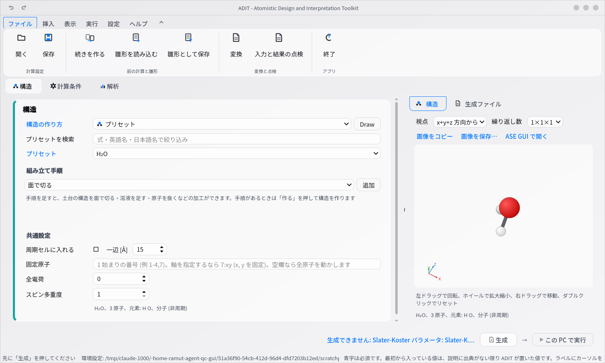
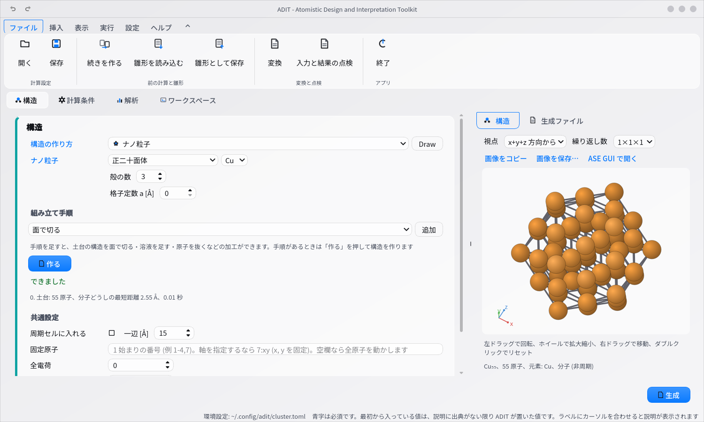
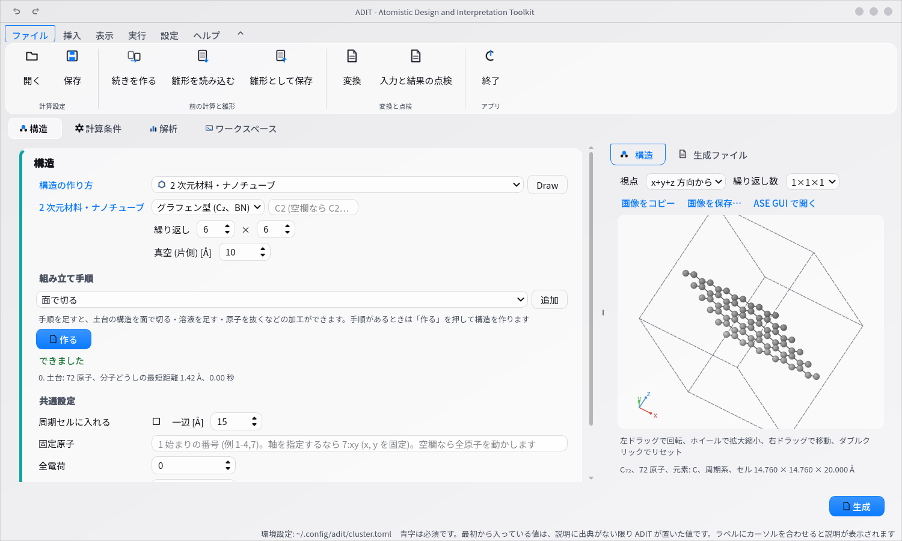
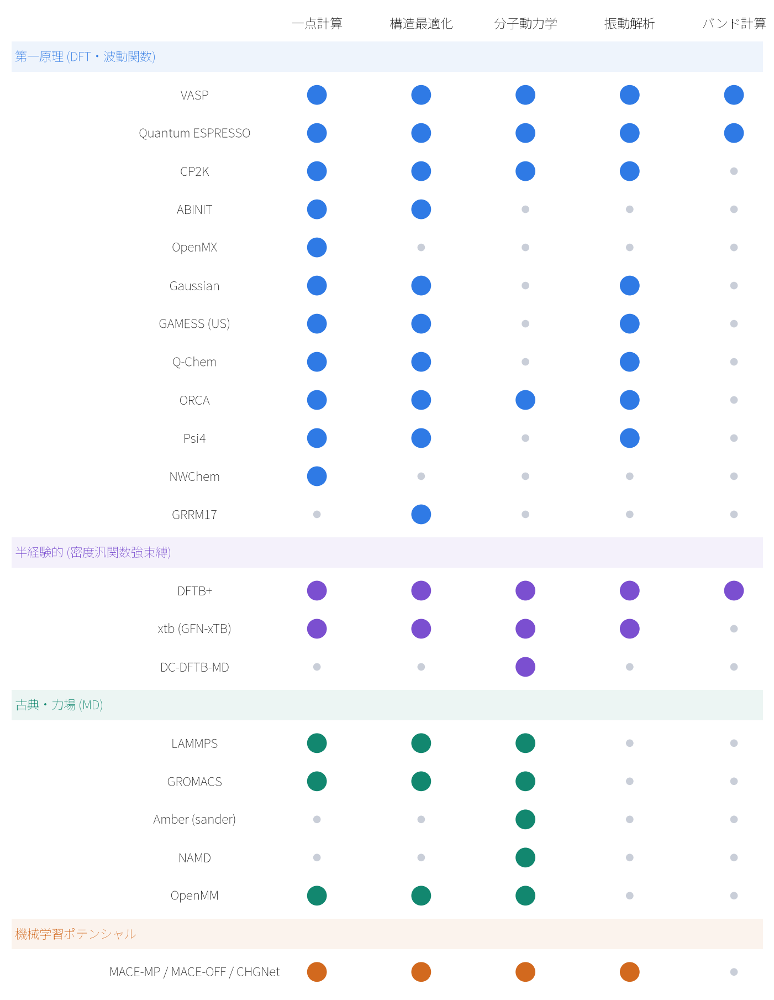
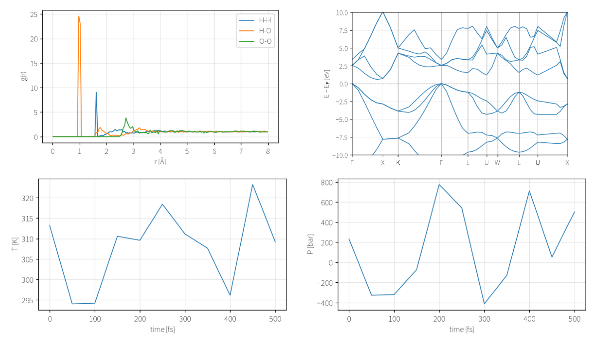

# ADIT

**Atomistic Design and Interpretation Toolkit** — 計算化学の計算を、**構造づくりから解析まで
画面の操作で進められる**デスクトップアプリです。

[](https://github.com/adit-chem-project/adit-chem/actions/workflows/tests.yml)
[](https://pypi.org/project/adit-chem/)
[](https://pypi.org/project/adit-chem/)
[](LICENSE)



ADIT を使うと、次のことが 1 つのアプリでできます。

- **構造を作れます** — 分子、結晶、表面、溶液、ナノ粒子、ポリマー。描いて作ることもできます
- **計算ソフトと条件を選ぶだけで、実行に必要なファイル一式が自動で作られます**
- **ターミナルがアプリの中にあります** — 計算機に `ssh` でつなぎ、そのまま投入できます
- **結果を解析して、図と表にできます** — 論文やスライドにそのまま貼れます

計算機実験に必要な作業がこれ 1 本でそろうので、**いくつものソフトを行き来せずに済みます。**

プログラムの操作はまだ得意ではない、という人に使ってほしいアプリです。
学部 4 年で研究室に入ったばかりで、コマンドを打つのもこれからという段階でも、
画面を見ながら計算の準備と解析を進められます
(計算機に投げるときだけは、ターミナルでコマンドを打ちます。その練習にもなります)。

---

## インストール

**Windows** — [Releases](https://github.com/adit-chem-project/adit-chem/releases) から
`ADIT-windows-x64.zip` をダウンロードし、展開して `ADIT.exe` を起動します。
初回に SmartScreen の警告が出たら「詳細情報」→「実行」を選んでください。

**macOS** — 同じ場所から `ADIT-arm64.zip` を落とし、初回だけ Finder で右クリック →「開く」を選びます。

**Linux、または自分で環境を管理したい場合**

```bash
git clone https://github.com/adit-chem-project/adit-chem.git
cd adit-chem && pip install -e ".[gui,smiles,analysis]"
adit
```

計算ソフト (DFTB+、VASP、Quantum ESPRESSO ほか) と、そのパラメータ (Slater-Koster、擬ポテンシャル、POTCAR) は
別途用意してください。詳しい手順は [各 OS のインストール方法](docs/INSTALL.md) にあります。

**使い方は [チュートリアル](docs/USAGE.md) にあります。**水の構造最適化を、画面の写真つきで最初から最後まで追えます。

## できること

### 構造を作る

分子 (プリセット・SMILES・Draw で手描き)、バルク結晶、表面スラブ、溶液・混合物、
2 次元材料・ナノチューブ、ナノ粒子、ポリマー。作った構造は 3D でマウスで回して確かめられます。

| ナノ粒子 | 2 次元材料 |
|---|---|
|  |  |

面で切る・溶液の層を足す・原子を抜く・吸着させる、といった加工を手順として重ねられるので、
電極と電解質の界面のような構造も画面で組み立てられます。

### インプットファイルを作る

21 の計算ソフトに対応しています。



書き出されるのは、インプットファイル、実行用の `submit.sh`、実行方法の手引き `README.txt`、
条件を保存した `spec.json` (読み込めば同じ入力を作り直せます)、解析用の `analyze.py` です。
クラスタ向けに作ると、転送と投入のコマンドを書いた `transfer_and_submit.sh` も付きます。

### ファイルを扱う・ターミナルを使う

**ワークスペース** タブに、ファイルのツリー・エディタ・ターミナルがあります。インプットの手直し、
ファイルの整理、`ssh` でのクラスタ接続まで、画面を切り替えずに行えます。


### 結果を解析する

エネルギー・温度、RDF、MSD と拡散係数、状態密度、バンド図、振動数とスペクトル (赤外・ラマン)。
配位数、構造因子 S(q)、水素結合、Voronoi、溶媒接触表面積、自由エネルギー面など、80 以上の解析手法に対応しています。



解析の**要約**には、値ごとに「その値を読み取ったファイル名と行番号」が付きます
(画面の解析タブと、書き出される `analysis/summary.txt` の両方)。転記した数字を後から追えます。

```
原子の電荷 (Mulliken、detailed.out:18、単位 e): O1 -0.606, H2 +0.294, H3 +0.312
```

### 図を論文やスライドへ

構造式・3D 表示・解析の図を、SVG・PNG・MOL で書き出せます。
画像をクリップボードにコピーして、例えば Word にそのまま貼ることもできます。
線の色・目盛りの向き・グリッド線・枠を指定して保存できるので、投稿先の指定にも合わせられます。

### 計算の記録を残す

**計算の条件と結果を、そのまま記録として残せます。**次のようなときに役立ちます
(書き出されるのは記録だけで、記録が無い項目は「未記録」と書かれます)。

| したいこと | 機能 | 出てくるもの |
|---|---|---|
| 論文の「計算方法」を書きたい | 方法の記述 | 計算ソフトとそのバージョン、汎関数、基底関数、k 点 (Markdown) |
| 条件を変えた計算をまとめて示したい | 条件の一覧 | 1 計算 1 行の表。温度を変えた 5 本なら 5 行 (CSV) |
| 結果を一覧で確かめたい | 結果の一覧 | 最終エネルギー、平均温度、フレーム数、正常終了したか (CSV) |
| 計算一式を第三者へ渡したい | 再現用の一式 | インプット + **計算ソフトのバージョン** + **擬ポテンシャルなどの実体** + SHA-256 (ZIP) |
| インプットを手で直したか確かめたい | ファイルの照合 | `spec.json` と実際のファイルの食い違い (例: ENCUT が 400 と 520 で違う) |

詳しくは [計算条件の報告](docs/REPORT.md)。

## ドキュメント

| 文書 | 内容 |
|---|---|
| [各 OS のインストール方法](docs/INSTALL.md) | Windows / macOS / Linux。実行ファイルの作り方も |
| [チュートリアル](docs/USAGE.md) | 画像つき。構造づくり、インプットの作成、実行、解析 |
| [画面の説明](docs/SCREENS.md) | それぞれの欄が何を指定するか |
| [対応ソフトウェア](docs/SOFTWARE.md) | 計算ソフトごとに、対応している計算とその範囲 |
| [環境設定](docs/SETTINGS.md) | 計算ソフトの場所、クラスタのプロファイル |
| [解析の詳細](docs/ANALYSIS.md) | 解析手法ごとの中身と条件 |
| [重い解析](docs/HEAVY_ANALYSIS.md) | 大きな軌跡を計算機で処理する |
| [Python API](docs/API.md) | ライブラリとして使う |

## ライセンス

[MIT](LICENSE) です。`examples/` と `tests/data/` に含まれる他プロジェクト由来のファイルは、
元のライセンスのままです ([一覧](THIRD_PARTY_NOTICES.md))。
