# チュートリアル

水分子の構造最適化を、最初から最後まで画面で進めます。**所要 5 分、コマンドは使いません。**

インストールは [インストール方法](INSTALL.md) にあります。

---

## 1. 構造を選ぶ

**構造** タブで作り方を選びます。プリセットから `H2O` を選ぶと、右側に 3D 表示が出ます。

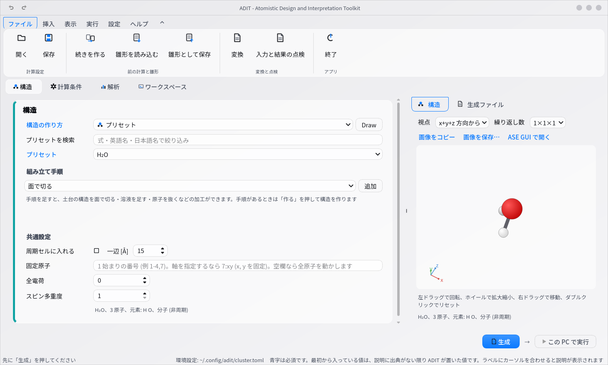

- 左ドラッグで回転、ホイールで拡大縮小、右ドラッグで移動
- 視点のプルダウンで `x 軸から` `y 軸から` `z 軸から` を選べます
- 枠の左下の矢印は、構造と一緒に回る座標軸です

## 2. 計算条件を決める

**計算条件** タブで、計算コードと計算の種類を選びます。ここでは DFTB+ と構造最適化です。

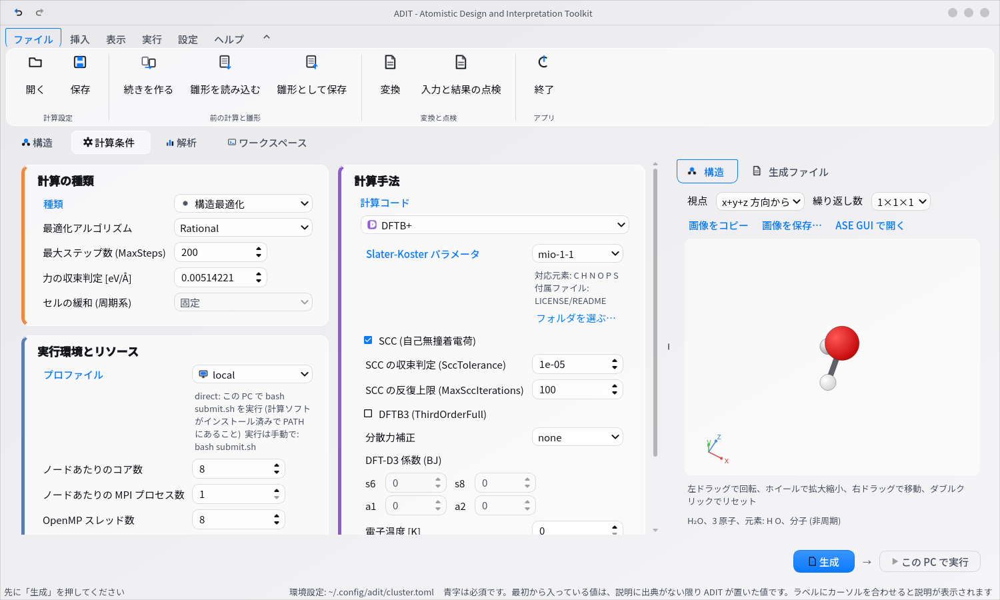

- **青い文字の欄は必須**です。空欄のままだと生成できません
- 最初から入っている値は、計算コード自身の既定値です (ADIT が勧めた値ではありません)
- ラベルにカーソルを合わせると、その欄の説明が出ます

## 3. 入力を生成する

右下の **生成** を押すと、選んだフォルダに入力ファイル一式が書き出されます。右側の **生成ファイル** で中身を確認できます。

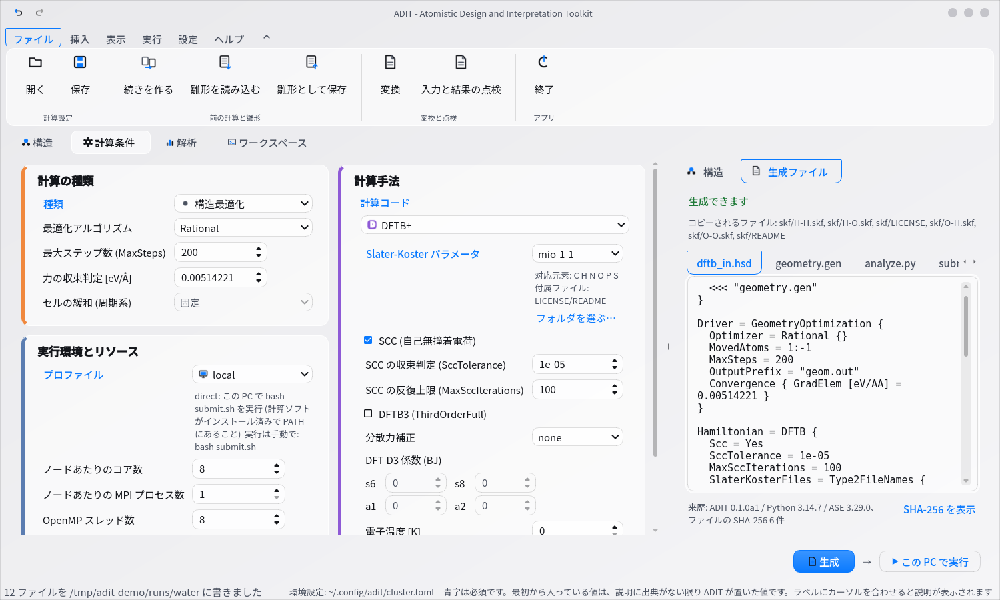

書き出されるもの:

| ファイル | 内容 |
|---|---|
| `dftb_in.hsd` など | 計算コードの入力 |
| `submit.sh` | 計算を実行するスクリプト |
| `README.txt` | 実行方法の手引き |
| `spec.json` | 設定した条件。読み込めば同じ入力を作り直せます |
| `analyze.py` | 解析用のスクリプト |
| `transfer_and_submit.sh` | クラスタへ送って投入するコマンド (クラスタ向けのときだけ) |

クラスタで計算する場合は、このフォルダを転送して `bash submit.sh` を実行します。

## 4. この PC で実行する

計算ソフトがこの PC に入っていれば、**この PC で実行** で走らせられます。進み具合と結果が右側に出ます。

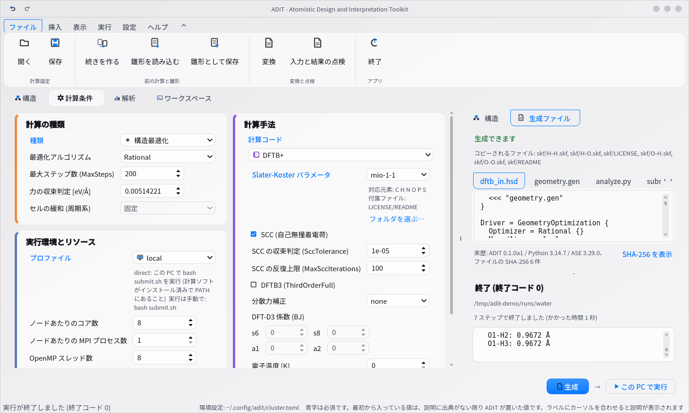

## 5. 結果を解析する

**解析** タブでは、計算したフォルダが自動で入っています。見たい項目に印を付けて **解析を実行** を押します。

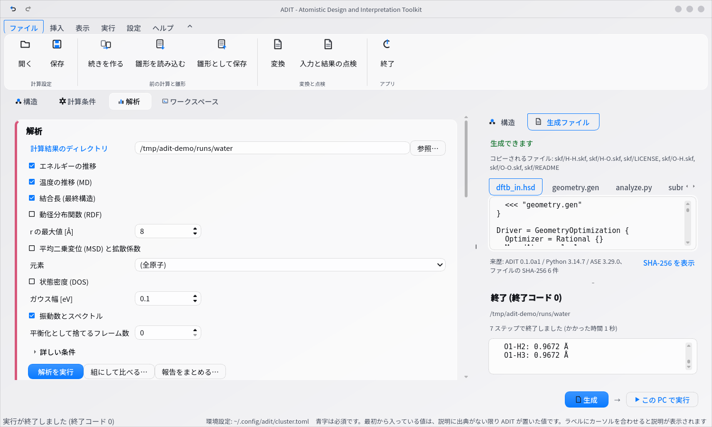

要約・表・図が下に並びます。図はその場で**コピー**でき、**保存**もできます。

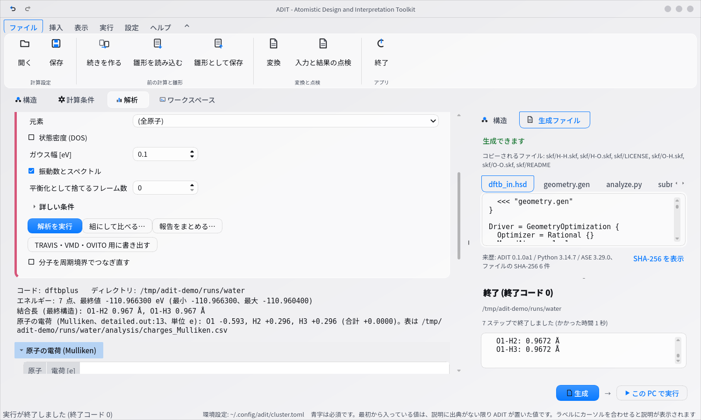

数値には単位と、その値を読み取ったファイル名・行番号が付きます。

---

## ほかの構造の作り方

**バルク結晶**: 元素と結晶構造、格子定数を指定します。表面スラブもここから作れます。

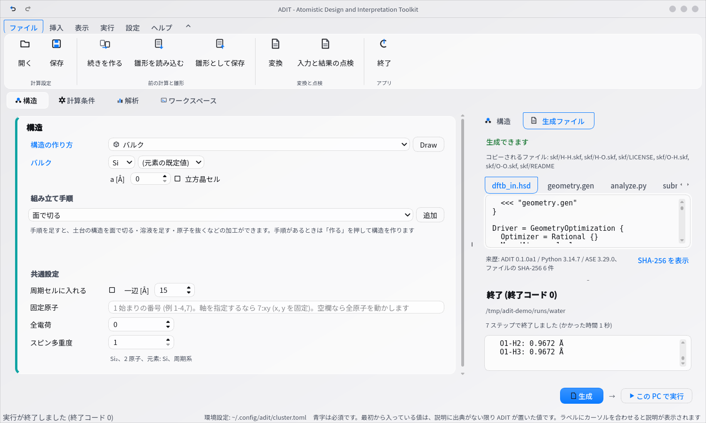

**溶液・混合物**: 成分と個数、密度を指定すると、分子を詰めた箱を作ります。

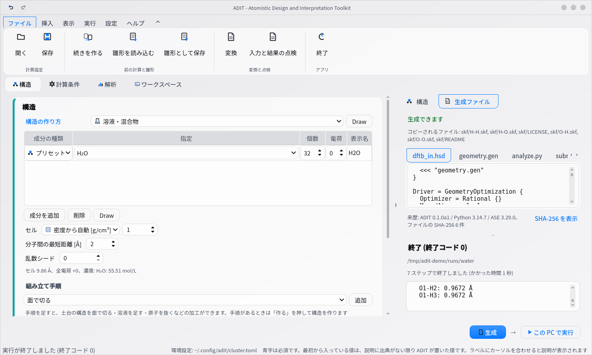

**分子を描く**: リボンの **挿入** → **Draw**。描いた分子はそのまま構造として使えます。SMILES からの読み込みもできます。

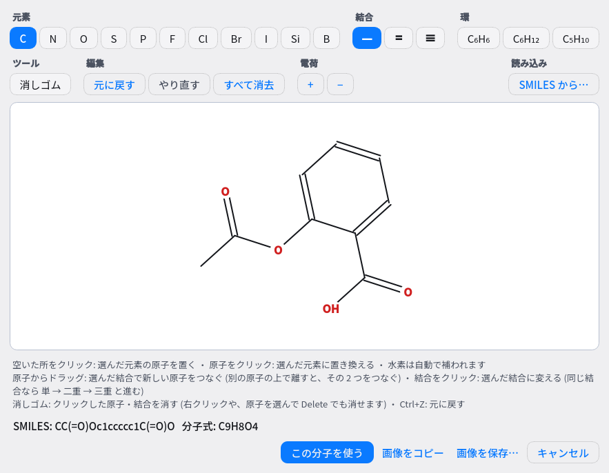

## まとめて作る

リボンの **実行** タブに、複数の計算を一度に作る機能が並んでいます。

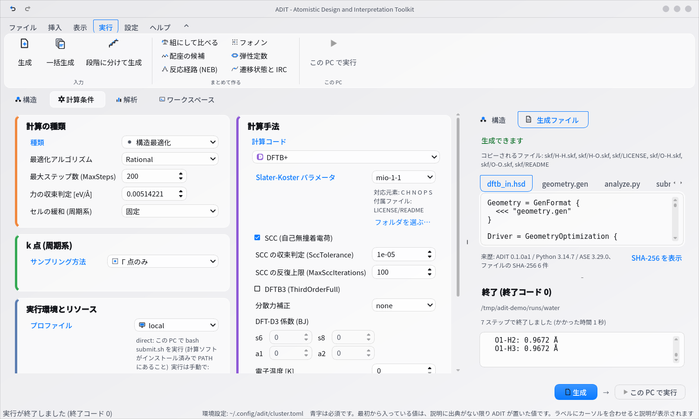

**一括生成** は、1 つの値だけを変えた計算を並べて作ります (カットオフや k 点の収束確認、格子定数の探索)。

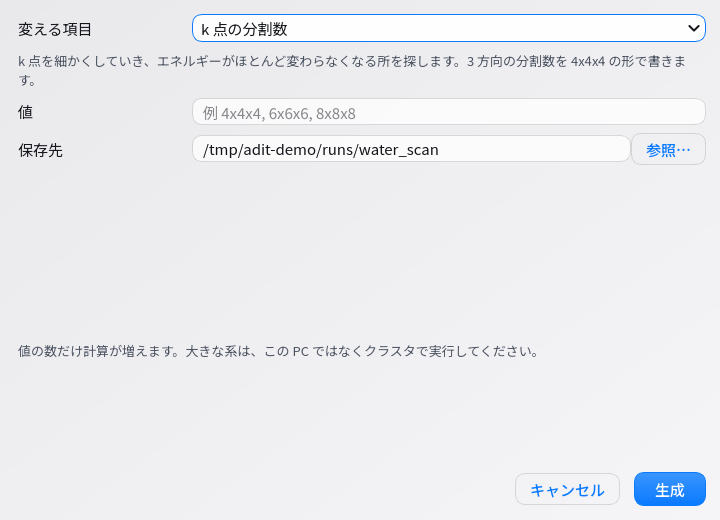

**段階に分けて生成** は、最小化 → NVT → NPT → 本計算のように、順に実行する計算を作ります。前の段階の最終構造は、次の段階を実行する直前に自動で引き継がれます。

**まとめて作る** には、組にして比べる・配座の候補・反応経路 (NEB)・フォノン・弾性定数・遷移状態と IRC があります。

## 報告をまとめる

解析タブの **報告をまとめる…**、または複数のフォルダをまとめて指定します。方法の節・条件の表・結果の表・再現用の一式を書き出せます。

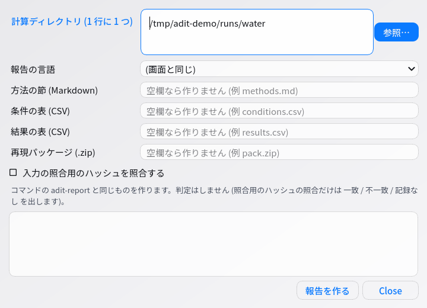

## 図の見た目を変える

解析タブの **詳しい条件** を開くと、線の色・目盛りの向き・グリッド線・枠を指定できます。論文誌の指定に合わせるときに使います。

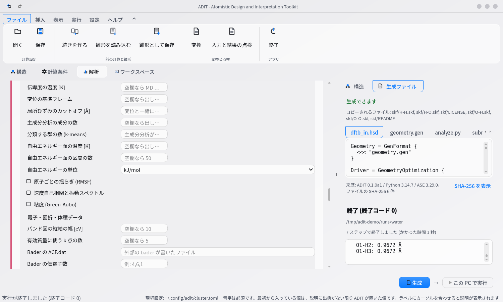

## ファイル形式を変換する

リボンの **ファイル** → **変換**。構造ファイルの相互変換と、計算コード間の条件の変換ができます。

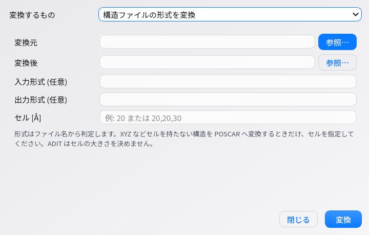

## ワークスペース: ファイル・エディタ・ターミナル

**ワークスペース** タブでは、ファイルの一覧・編集・ターミナルを 1 つの画面で扱えます。
画面を切り替えずに、インプットを直したり、ファイルを動かしたり、計算機に `ssh` で入ったりできます。

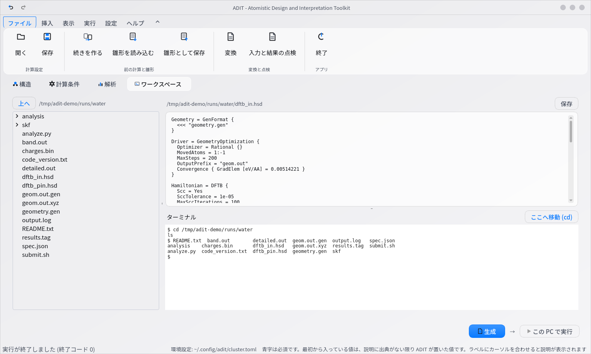

- **左のツリー**: ダブルクリックで開く。右クリックで名前の変更・フォルダの作成・ターミナルでそこへ移動
- **右上のエディタ**: テキストのファイルなら何でも開けます (インプット、`output.log`、メモ)。`保存` で書き戻します
- **右下のターミナル**: 手元のシェルがそのまま動きます。`ssh <ユーザー名>@<クラスタ>` でクラスタに入り、
  `transfer_and_submit.sh` のコマンドを貼れば、転送から投入までここで済みます
- 使うシェルは環境変数 `ADIT_SHELL` で変えられます (例: `ADIT_SHELL="bash --norc"`)

Windows では PowerShell が動きます。Linux と macOS では、`vim` のような画面を使うプログラムもそのまま動きます。

## 入力と結果を点検する

リボンの **ファイル** → **入力と結果の点検**。他のソフトで作った入力の読み込み、生成した入力が書き換わっていないかの照合、2 つの計算の条件の突き合わせができます。

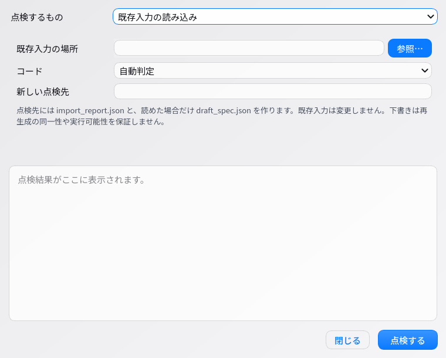

---

## コマンドラインから

同じ操作をコマンドでも行えます。多数の計算を自動で回すときに使います。

```bash
adit-gen --list-samples                       # 付属の例を一覧で見る
adit-gen --sample water_generated mine.json   # 1 つ写して、自分の条件ファイルにする
adit-gen mine.json runs/water                 # 入力ファイル一式を書き出す
adit-gen mine.json runs/water --run           # 書き出して、そのまま実行する
adit-analyze runs/water --rdf --msd           # 解析して図と要約を出す
adit-report runs/*/ -o methods.md             # 方法の節を書き出す
```

一括生成と構造の差し替えは、次の形です。

```bash
adit-gen mine.json out/ --scan method.ecutwfc=30,40,50    # 1 つの値を振る
adit-gen mine.json out/ --structures "mols/*.xyz"         # 構造だけ差し替えて一括
adit-gen mine.json out/ --stages stages.json              # 段階に分けて生成
```

詳しい一覧は `adit-gen --help`、解析は `adit-analyze --help-all` で出ます。
Python から部品として呼ぶ場合は [Python API](API.md) を参照してください。
